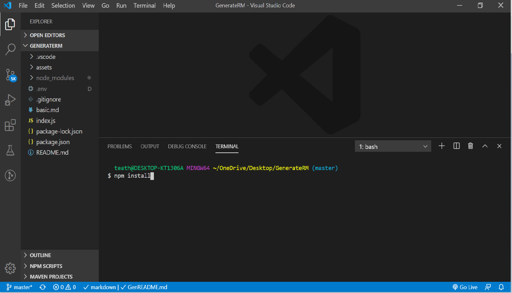

  
  

  
  
 
  # **Project** test
  
 

  ##  **_Live Link_** 
  *  ~~_Insert Live Link Once Generated_~~
  
  ##  **Table of Contents**
  * Description
  * Installation
  * Technology Stack
  * Usage

  ##  **Description**
  test

  

  ## **Installation**
  test

  
 
  

  ## **Technology Stack**
  

  ##  **Usage**
  test

  

  ###  **Contributors**
  test

  ## **Contact**
  ####  Name: theresa
  ####  GitHub https://github.com/git-theresa
  ####  Portfolio 
  ~~undefined~~
  ####  Email: [t.eatherly@gmail.com](t.eatherly@gmail.com)
  ####  LinkedIn: https://www.linkedin.com/in/test
  
  #####  **License** 
   MIT

  #####  Tests
  _To run tests, use the following command:_  test
  

