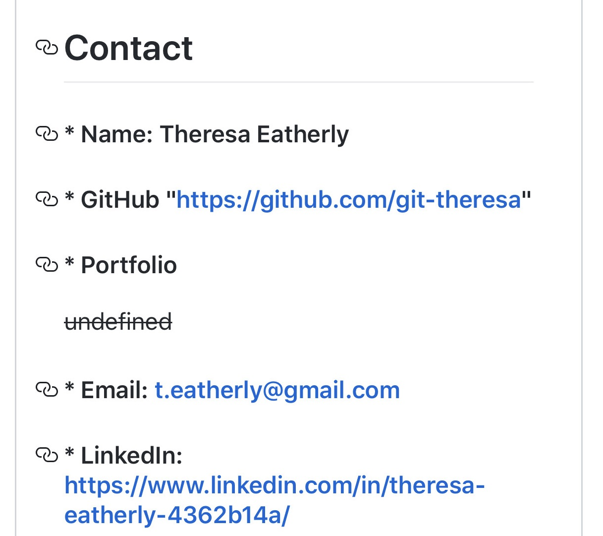

  
  

  
  
 
  # **Project** Generate ReadME
  
 

  ##  **_Live Link_** 
  *  ~~_Insert Live Link Once Generated_~~
  
  ##  **Table of Contents**
  * Description
  * Installation
  * Technology Stack
  * Usage

  ##  **Description**
  Generate ReadMe allows a developer to create a ReadMe/MarkDown file using Node.js

  

  ## **Installation**
  JSON Package Included

  
 
  

  ## **Technology Stack**
   Node.Js, JavaScript, jQuery, GIT, GitHub, HTML, CSS, APIs, Command- Line

  ##  **Usage**
  After forking this repository in your GitHub, the user will install all dependencies within the given JSON Package. _To install, open the terminal into the correct directory and simply type **npm install.**_  After installation, the user will answer a series of prompts given in the terminal command line. **All answers must have correct spelling and/or punctuation. Any typo will give anerror!** _If GitHub's API does not recognize the user's input, or if the user has missing information on their GitHub profile, **undefined** will be a returned response._  Once all questions are answered, the command line will return **Success!**  Lastly, the userwill use all git commands _(git add -A, git commit -m "", git push)._  Once successfully pushed, Generate ReadME will generate a clean and presentable ReadME.MD  The new MarkDown file will also include a badge for the license chosen, email address, and profile picture!

  

  ###  **Contributors**
  @git-theresa

  ## **Contact**
  ####  Name: Theresa Eatherly
  ####  GitHub https://github.com/git-theresa
  ####  Portfolio 
  ~~undefined~~
  ####  Email: [t.eatherly@gmail.com](t.eatherly@gmail.com)
  ####  LinkedIn: https://www.linkedin.com/in/theresa-eatherly-4362b14a/
  
  #####  **License** 
   MIT

  #####  Tests
  _To run tests, use the following command:_  npm run test
  

